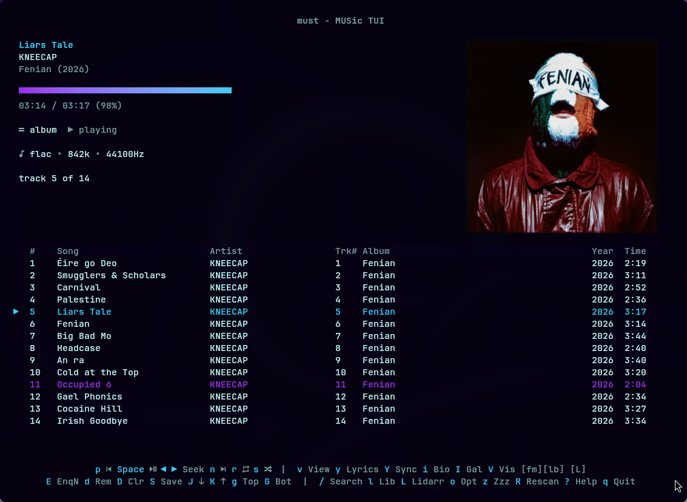
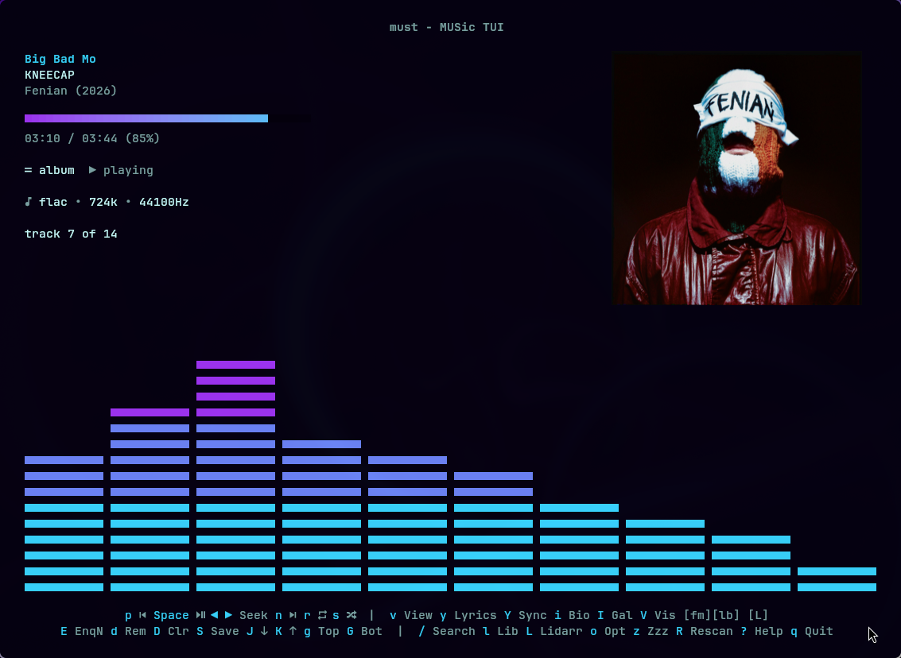

[](https://github.com/pdfrg/must/actions/workflows/ci.yml)

<table>
<tr>
<td></td>
<td>

# must - MUSic TUI

### A fast, beautiful TUI music player for your local music library _and_ Subsonic-compatible streaming server. Built with Go + Bubble Tea.

</td>
</tr>
</table>

<br>



**See additional [SCREENSHOTS.md](SCREENSHOTS.md).  Includes themes, views, modals, and IPC examples.**

## There's a million music players, why must?

1. TUI speed — incredibly fast, responsive, keyboard-driven.

2. Play local music files, from your streaming server, or **both at the same time**.

3. Prominent high-res album art _in the terminal_.

4. Easy keybindings, always visible in footer. No memorization needed.

5. Lyrics and artist info view, with artist thumb, image gallery, discography, and bio.

6. Fuzzy search all or specific tags (artist, album, year, genre).

7. Omarchy theme integration with live reloads.

8. IPC control — control must from the command line while it's running.

9. Download/temp directory browser — trial those potentially janky mp3s you grabbed before promoting them to your library.



## Features

- **Local Music Library**: Scan and browse your music collection with a 3-column browser (artists, albums, tracks), genre browsing, and field-specific search
- **Smart Search**: FTS5-powered full-text search with field queries (`artist:radiohead year:1997`) and year range filtering
- **MPV Backend**: Full gapless audio playback with seek, repeat (off/all/one), shuffle, progress tracking, and ReplayGain normalization
- **Lyrics**: Fetch plain and synced lyrics from [LRCLib](https://lrclib.net/)
- **Artist Info**: Bios from TheAudioDB, Discogs, and Wikipedia. Discographies from MusicBrainz. Artist images from local files or online APIs.
- **Album Art**: Smart terminal image support via go-termimg (Kitty, iTerm2, Sixel, halfblocks fallback). Local-first with online fallback.
- **Scrobbling**: Last.fm and ListenBrainz support
- **Lidarr Integration**: View artist/album monitoring status, open in Lidarr
- **Visualizer**: 9 real-time audio visualizations (bars, braille, wave, stars, rain, etc.)
- **Themes**: 6 built-in themes, custom colors.toml, automatic Omarchy theme detection with live-reloads
- **Playlist Management**: Reorder (J/K/g/G), save (S), delete (d), clear (D), enqueue next (E), and reverse playlist order (X).
- **Session Restore**: Automatically restores last session on startup
- **Sleep Timer & Alarm Clock**: Fall asleep or wake up to your music
- **4 Layouts**: `large` (default), `medium`, `compact`, `narrow` (sidebar or mobile format)
- **IPC Control**: Control a running must instance from the terminal (`must play`, `must next`, `must find radiohead`, etc.)
- **Subsonic/Navidrome Integration**: Search and stream from any Subsonic-compatible server (Navidrome, Jellyfin, etc.). Use `subsonic:artist:<q>`, `subsonic:album:<q>`, etc. in IPC searches, or configure a server name alias like `navidrome:<q>`. Search modal supports local-only, subsonic-only, or combined search mode.
- **Options Modal**: Adjust replaygain, view, and visualizer settings on the fly
- **Temp Directories Modal**: Easily find and play music not stored in the main library.  Perfect for listening to recent downloads before deciding whether to add to your library.
- **Media Keys Support**: Use your keyboard's media keys to control playback (e.g. Fn+F4 to play/pause).  Requires `mpv-mpris`.
- **Desktop Notifications**: On song changes, with optional album art.  Requires `libnotify`.

## Installation

### Prerequisites

- **mpv** — Required for audio playback
- **Go 1.26+** — To build from source
- **Any NerdFont** — For proper symbol display

### Recommended

- **mpv-mpris** — Required for media key support
- **libnotify** — Required for desktop notifications. `libnotify-bin` on Debian/Ubuntu.

### Build from Source

```bash
git clone https://github.com/pdfrg/must.git
cd must
go build -o must ./cmd/must
```

### Install with Go

```bash
go install github.com/pdfrg/must/cmd/must@latest
```

## Supported Formats

MP3, FLAC, OGG, Opus, M4A, AAC, WMA, WAV

## Documentation

See [DOCUMENTATION.md](DOCUMENTATION.md) for cli usage, IPC control commands, keybindings, configuration reference, album art/artist image priority, XDG paths, search architecture, and database schema.

## Attribution

Audio visualizations: [cliamp](https://github.com/bjarneo/cliamp). Awesome music player with retro Winamp style in the terminal.

## See Also

**If you like must, please check out [rptui](https://github.com/pdfrg/rptui), a Radio Paradise TUI.**

## License

MIT
